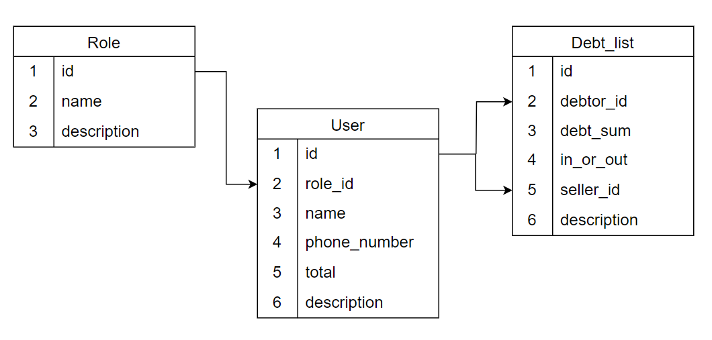

<p align="center"><a href="https://laravel.com" target="_blank"></a></p>


## About project

this project perfectly fulfills the function of the loan book installed in many stores.

The PROJECT includes the following

- enter, read and change detailed information about debtors.
- view the debt history of debtors and monitor the total amount of debts.
- View the list of debt transactions sorted by date
- tracking the seller who served the debtor
- view the total debts of all debtors in the store and the total amount given by the store for debtors
- Every operation is recorded and protected from external attacks

## project presentation
[](https://www.youtube.com/watch?v=UtcIxZPaG0w)

## database schema


* total - the debtor's total debt
* debt_sum - amount in debt process
* seller_id - service salesperson ID
* in_our_out(boolean) - if borrowed => true, if the debt is paid => falsa


## Install project

```
composer install
```
```
npm install
```
```
php artisan key:generate
```
```
php artisan migrate:fresh --seed
```
```
npm run dev
```
```
php artisan serve
```

### account to access the program
* Role: seller<br>
  login: seller1@gmail.com<br>
  password: access
* Role: seller<br>
  login: seller2@gmail.com<br>
  password: access
* Role: seller<br>
  login: seller3@gmail.com<br>
  password: access

### .env
* DB_DATABASE=debtbook
